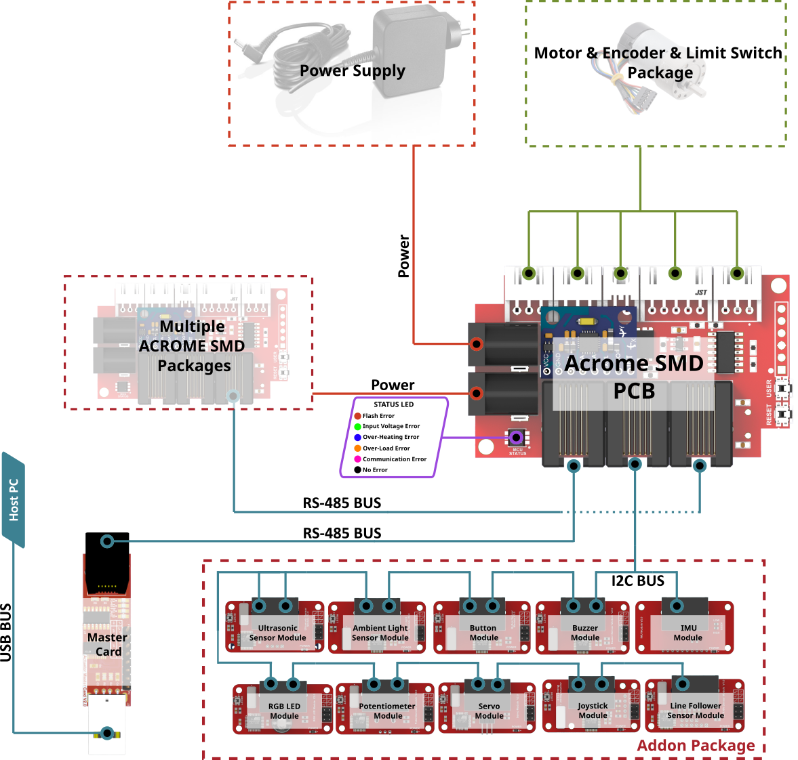
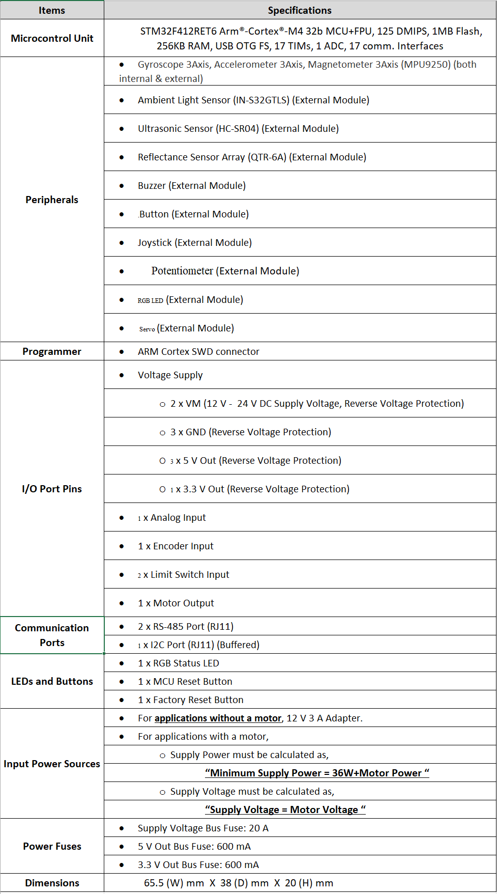

Getting Started
=====

The ACROME SMD - Brushed DC Motor Driver
-----------------

A powerful solution for many system development, the ACROME SMD - Brushed DC Motor Driver board is equipped with a set of sensors and utilizes the I2C line to provide real-time readings. It is specifically designed to make controlling DC motors in mobile robots easy and convenient.

Features
~~~~~~~~~~~~~~~~~~~~~~

- Autotune function that optimizes the performance of the DC motor, ensuring that it operates at its best
  - Choice between aggressive optimization using the Ziegler-Nichols method or more gradual optimization using the Cohen-Coon method, depending on the specific requirements of the robot project
- Ability to synchronize multiple ACROME SMD - Brushed DC Motor Driver boards for controlling multiple motors simultaneously
The  ACROME SMD - Brushed DC Motor Driver board has the capability to work in synchronization with the RS485 protocol, This enhances its versatility as a solution for many system development, as RS485 is a commonly used communication protocol in industrial applications. With this feature, the Actuator v2 board can now communicate and control multiple Acrome motor drivers using the RS485 network.

Benefits
~~~~~~~~~~~~~~~~~~~~~~

- Versatile and powerful solution for mobile robot development
- Makes controlling and optimizing DC motors easier
- Ability to coordinate multiple motors crucial for the development and operation of mobile robots

Connections
~~~~~~~~~~~~~~~~~~~~~~

Hardware Specifications
~~~~~~~~~~~~~~~~~~~~~~

