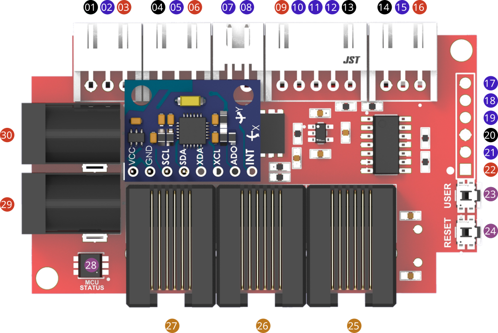
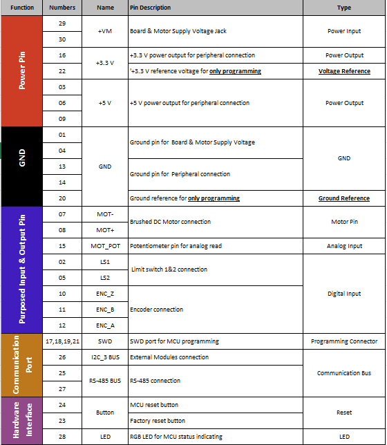
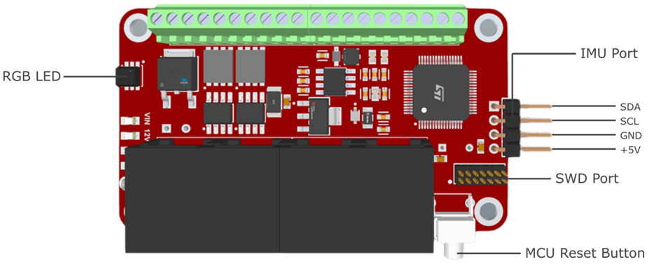
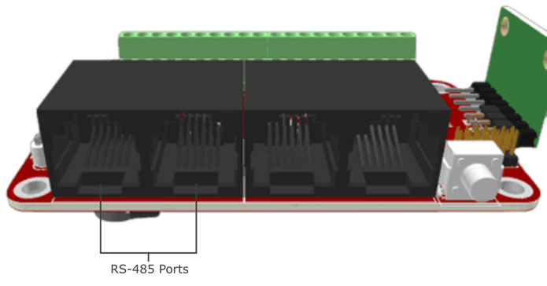

Pinout
=====
 
GPIO Descriptions
~~~~~~~~~~~~~~~~~~~~~~~~~~~~~~

   

   
Peripheral Ports
---------

   
RS485 Ports
---------

   
I2C Ports
---------

.. figure:: figures/I2CPorts.png
   :alt: I2CPorts 
