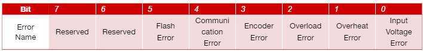
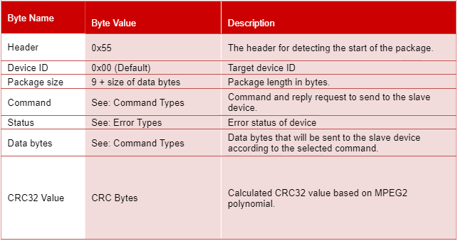

RS-485 Protocol
================

1. Registers
---------

1.1. Device ID
~~~~~~~~~

The user can change the ID of an Actuator by writing to this register. The Actuator boards will not check the bus for duplicate ID addresses so the user should be careful about duplicate IDs on the bus. This register can have values between 0 to 254. 0xFF is reserved for broadcast commands.

Users must reset the Torque Enable register to change device ID. If the Actuator receives a command to change this value while the Torque Enable register is set, the command will be discarded, and no changes will be made. 

1.2. Baud Rate
~~~~~~~~~

The user can select a baud rate between 1527 to 6250000 to communicate with the Actuator boards on the bus. Each actuator should be configured to use the selected baud rate before-hand. The default baud rate is 115200.

**Users must reset the Torque Enable register to change baud rate. If the Actuator receives a command to change this value while the Torque Enable register is set, the command will be discarded, and no changes will be made.**

**Users should prioritize selecting well known baud rates when configuring this register. If an arbitrary baud rate is to be used, users must ensure that their device can provide necessary baud rates. Even then, the arbitrary selections may exceed the acceptable discrepancy percentage the UART peripheral can handle.**

1.3. Status
~~~~~~~~~

This register holds the error flags of the Actuator and should be used for clearing any errors. (See: Error clear command)
    
* **Input Voltage Error:** This error bit will be set when the input voltage of the Actuator is higher than maximum input voltage or lower than minimum input voltage registers. These registers are configurable by the user. While this flag is set, the Actuator will keep its torque output disabled.

* **Overheat Error:** This error bit will be set when the temperature of the Actuator board is higher than the temperature limit register. This register is configurable by the user. While this flag is set, the Actuator will keep its torque output disabled.

* **Overload Error:** This error bit will be set when the flowing current on the motor driver is higher than the torque limit register. This register is configurable by the user. While this flag is set, the Actuator will keep its torque output disabled.

* **Encoder Error:** This error bit will be set when the Actuator fails to gather any encoder information for a period of time while applying power to the motor. While this flag is set, the Actuator will keep its torque output disabled.

* **Communication Error:** This error bit will be set when the Actuator receives a faulty package. This flag does not affect any operations of the Actuator and was added for informative purposes only.

* **Flash Error:** This error bit will be set when the Actuator fails to read from or write to EEPROM. When this flag is set, the user should check parameters for any misconfiguration first. If the Actuator fails to read from EEPROM, it will start with factory default parameters.

Please refer to the table below for read/write operations on this register.

1.4. Operation Mode
~~~~~~~~~
Users can select the preferred operation mode of the Actuator between the modes listed below.

 * Position Control Mode (Default)
 * Velocity Control Mode
 * Torque Control Mode
 
#. **Position Control Mode:** When this operation mode is selected, the Actuator will perform its movement according to position control mode parameters. Users can configure the Actuator to move to a specific position with this configuration. To configure this operation mode, the user should set the Operation Mode register to 0x00.

#. **Velocity Control Mode:** When this operation mode is selected, the Actuator will perform its movement according to velocity control mode parameters. Users can configure the Actuator to move continuously at desired velocity with this configuration. To configure this operation mode, the user should set the Operation Mode register to 0x01.

#. **Torque Control Mode:** When this operation mode is selected, the Actuator will perform its movement according to torque control mode parameters. Users can configure the Actuator to move with constant torque. To configure this operation mode, the user should set the Operation Mode register to 0x02.

1.5. Temperature Limit
~~~~~~~~~
Users can configure the Actuator board’s upper temperature limit to a certain value. This register represents the temperature value in Celsius degrees and is configurable between 0 to 255.

1.6. Torque Enable
~~~~~~~~~
This register controls the motor driver output. User should write 1 to enable motor driver output and 0 to disable.

1.7. Autotuner Enable
~~~~~~~~~
This register controls the start to autotuner . User should write 1 to enable autotuner  and user can select autotuner methods.

1.8. Minimum Voltage Limit
~~~~~~~~~
When the input voltage of the Actuator is lower than this register’s value, motor driver output of the Actuator will be disabled. The user can configure this value according to its own needs. This register can have values between 0-65535 and represents voltage limit in millivolts.

1.9. Maximum Voltage Limit
~~~~~~~~~
When the input voltage of the Actuator is higher than this register’s value, motor driver output of the Actuator will be disabled. The user can configure this value according to its own needs. This register can have values between 0-65535 and represents voltage limit in millivolts

1.10. Torque Limit Index
~~~~~~~~~
When the absolute current flowing through the motor is higher than this value, motor driver output will be disabled. The user can configure this value according to its own needs. This register can have values between 0-65535 and represent current flowing through the motor in milliamps. This register is independent from the operation mode and always will be checked in any operation mode.

1.11. Velocity Limit Index
~~~~~~~~~
When the absolute velocity of the motor is higher than this value, motor output will be disabled. The user can configure this value according to its own needs. This register can have values between 0-65535 and represents velocity as encoder ticks per 100ms. This register is independent from the operation mode and always will be checked in any operation mode.

1.12. Autotuner Methods
~~~~~~~~~
Users can select the preferred Autotuner method of the Actuator between the methods listed below:

* Ziegler Nichols
* Cohen Coon

**!** *Torque and autotuner must be enabled  before choosing a method.*

**Ziegler Nichols Method**
 When this Autotuner method  is selected, the Actuator will tune control  parameters according to the Ziegler Nichols method. To configure this Autotuner method , the user should set the Autotuner method register to 0x02.

**Cohen Coon**
 When this Autotuner method  is selected, the Actuator will tune control  parameters according to the Cohen Coon  method. To configure this Autotuner method , the user should set the Autotuner method register to 0x03.
 
1.13. Position Control Feed Forward
~~~~~~~~~
This register represents the feed forward parameter of the PID algorithm that is used for position control.

1.14. Velocity Control Feed Forward
~~~~~~~~~
This register represents the feed forward parameter of the PID algorithm that is used for velocity control.

1.15. Torque Control Feed Forward
~~~~~~~~~
This register represents the feed forward parameter of the PID algorithm that is used for torque control.

1.16. Position Control Scaler Gain
~~~~~~~~~
This register represents the scaler gain parameter of the PID algorithm that is used for position control.

1.17. Position Control P Gain
~~~~~~~~~
This register represents the kp parameter of the PID algorithm that is used for position control.

1.18. Position Control I Gain
~~~~~~~~~
This register represents the ki parameter of the PID algorithm that is used for position control.

1.19. Position Control D Gain
~~~~~~~~~
This register represents the kd parameter of the PID algorithm that is used for position control.

1.20. Velocity Control Scaler Gain
~~~~~~~~~
This register represents the scaler gain parameter of the PID algorithm that is used for velocity control.

1.21. Velocity Control P Gain
~~~~~~~~~
This register represents the kp parameter of the PID algorithm that is used for velocity control.

1.22. Velocity Control I Gain
~~~~~~~~~
This register represents the ki parameter of the PID algorithm that is used for velocity control.

1.23. Velocity Control D Gain
~~~~~~~~~
This register represents the kd parameter of the PID algorithm that is used for velocity control.

1.24. Torque Control Scaler Gain
~~~~~~~~~
This register represents the scaler gain parameter of the PID algorithm that is used for torque control.

1.25. Torque Control P Gain
~~~~~~~~~
This register represents the kp parameter of the PID algorithm that is used for torque control.

1.26. Torque Control I Gain
~~~~~~~~~
This register represents the ki parameter of the PID algorithm that is used for torque control.

1.27. Torque Control D Gain
~~~~~~~~~
This register represents the kd parameter of the PID algorithm that is used for torque control.

1.28. Home Offset
~~~~~~~~~
This register is for moving the zero point of the position control algorithm to a desired point. When this parameter is set to a value, the motor will move to provide this offset. Requires torque enable register to be enabled.

**Recommended use of this parameter is moving the motor to the desired offset position and then changing offset to desired value. This way, changing the register will not trigger a movement.**

1.29. Minimum Position
~~~~~~~~~
Users can configure a software limit switch with this register. When the Actuator’s position reaches to this value, it will not move further in negative direction. This parameter is bound to position control operation mode and will not be checked while operating in other modes.

1.30. Maximum Position
~~~~~~~~~
Users can configure a software limit switch with this register. When the Actuator’s position reaches to this value, it will not move further in positive direction. This parameter is bound to position control operation mode and will not be checked while operating in other modes.

1.31. Position Control Setpoint
~~~~~~~~~
This register is the setpoint of the position control algorithm. Register range is from 0 to 65535.

1.32. Velocity Control Setpoint
~~~~~~~~~
This register is the setpoint of the velocity control algorithm. Register range is from 0 to 65535.

1.33. Torque Control Setpoint
~~~~~~~~~
This register is the setpoint of the torque control algorithm. Register range is from 0 to 5000.

1.34. Buzzer Enable
~~~~~~~~~
This register sends  request to the buzzer module.

1.35. Present Position
~~~~~~~~~
This register represents the position of the motor in encoder ticks in that time.

1.36. Present Velocity
~~~~~~~~~
This register represents the velocity of the motor in encoder ticks / 100ms.

1.37. Present Current
~~~~~~~~~
This register represents the torque of the motor in milliamps in that time.

1.38. Present Voltage
~~~~~~~~~
This register represents the input voltage of the Actuator in millivolts in that time.

1.39. Present Temperature
~~~~~~~~~
This register represents the circuit board temperature in Celsius in that time.

1.40. IMU
~~~~~~~~~
There are 2 register for IMU sensor.Present roll and pitch registers.

* **Roll register**
 This register represents the roll data of IMU

* **Pitch register**
 This register represents the pitch data of IMU 

1.41. Light Intensity
~~~~~~~~~
This register represents the intensity of light .
	
1.42. Button Pressed
~~~~~~~~~
This register represents the button status.If button is pressed ,register send 1 value 

1.43. Present Distance
~~~~~~~~~
This register represents the distance between sensors and objects.

1.44. Joysticks
~~~~~~~~~
There are 3 registers for Joysticks X, Y and Button registers.

* Joysticks X 
 The  register represents the x-axis position of joysticks. While moving the joystick button on the x-axis,register value will change between 0 and 1023.AlsoY-axis initial value changes around 500.

* Joysticks Y
 The  register represents the y-axis position of joysticks.While moving the joystick button on the Y-axis,register value will change between 0 and 1023.AlsoY-axis initial value changes around 500.

* Joysticks Button
 This register represents the button status.If button is pressed ,register send 1 value

1.45. QTR
~~~~~~~~~
There are 3 registers for QTR .left,right and mid.

* **Right**
 This register represents the right phototransistor.If there is an object in front of the photo-transistor,this register will send 1 value.
* **Mid**
 This register represents the mid phototransistor.If there is an object in front of the photo-transistor,this register will send 1 value.
* **Left**
 This register represents the left phototransistor.If there is an object in front of the photo-transistor,this register will send 1 value.

1.46. Model Number
~~~~~~~~~
This register holds the model number of the Actuator board.

1.47. Firmware Version
~~~~~~~~~
This register holds the firmware version of the Actuator board.

1.48. Error Count
~~~~~~~~~
This register holds the count of total errors since the last reboot. Whenever an error occurred, this value incremented by 1. This register can be used to diagnose errors on the Actuators. For example, high error count value with communication error flag raised status register might be indicating an issue with communication bus connections or buggy protocol implementation.

2. Protocol Overview
---------

The protocol is working on a UART interface at up to 9M baud. Each package transmitted from the master device needs to be followed by a delay of minimum 1-byte-long of the selected baud rate at the time. However, a 2-byte-long delay is recommended to tolerate any possible timing issues since UART is an asynchronous communication interface.
	
Each package must have a preliminary information part before data bytes and an MPEG2 CRC32 value at the end of the package. These values are disclosed in Table 1. The whole communication protocol is based on little-endian architecture.

**Note:** If the user wants to broadcast a command to all the slave devices in the communication line, Device ID field should set to 0xFF. When a broadcast massage is transmitted, no reply will be received from any of the Actuators on the bus.

2.1. Command Types
~~~~~~~~~

2.1.1. Ping Command
**********************
When the Actuator receives a package with a ping command, it will reply to the user with a ping package. The only difference between two packages is the 4th byte of the package that has been sent to the Actuator is the status register of the device.

2.1.2. Write Command
**********************
When the user wants to change the registers of the Actuator, the user should send a package that contains information about the required register pointers and register values with this command. The user should place pointer values and register data in the data field of the package template according to the given example below.

2.1.3. Read Command
**********************
When the user wants to read the registers of the Actuator, the user should send a package that contains information about the required register pointers with this command. The user should place pointer values in the data field of the package template according to the given example below.

2.1.4. EEPROM Write Command
**********************
When the user wants to save already-written data to the non-volatile memory of the Actuator, should send a package with this command. Actuators do not respond this command. Execution of this command takes about 300ms since writing to flash memory is a relatively slow operation. Keeping torque output disabled is recommended but not mandatory while sending this command.

2.1.5. Reboot Command
**********************
When the user wants to reboot the device, should send a package with this command. The device will be rebooted immediately and all parameters on the RAM will be replaced with the values that stored on the EEPROM.

2.1.6. Factory Reset Command
**********************
When the user wants to replace all parameters with the default ones, should send a package with this command. When this command is sent, Actuator is going to reset all parameters to their out-of-factory values, including ones that are saved to the EEPROM.

2.1.7. Error Clear Command
**********************
When the user wants to clear any errors on the Actuator, should send a package with this command. Users should set the status field of the package with the flags of the errors that will be cleared. To clear all errors, the user should set the status field to 0xFF. For details of error flags, see the Status register description.

2.1.8. ACK Flag
**********************
When the user wants to get a reply from Actuator after write command, should set the 7th bit of the command register. If the user sends ACK, the Actuator will return all of its parameters as the reply. Ping packages always get replies from the Actuators.
