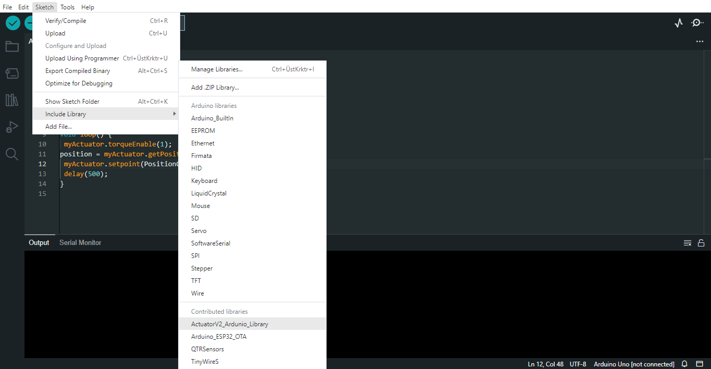

Arduino Library
================

How to set up? Step by step
---------------------------

* İnstall this code https://github.com/Acrome-Robin/SmartActuator_Ardunio_Library 
* Unzip this file 
* Move this file to the Arduino library . (Default library location C:\Users\Documents\Arduino\libraries)
* If you will install first library, you can create folder called "libraries"

How can I include the Actuator library in my Arduino code?
-----------------------------------------------------------

Example code
================

tAutotuneMethod
----------------

This type definition is used for autotune methods of Actuator. The definition is an enum with 2 different possible values.

Possible values are:

- ZieglerNichols: The Ziegler-Nichols tuning method is a process for determining the optimal parameters for a PID (Proportional-Integral-Derivative) control system to achieve stable and accurate control of a dynamic process.

- Cohen Coon: The Cohen-Coon method is a process for determining the optimal parameters for a PID (Proportional-Integral-Derivative) control system by using frequency response data to model the process and provide improved robustness compared to the Ziegler-Nichols method.

Void Actuator::setAutotuneEnable()
----------------------------------

This method sends a write package and does not return any value. When this command is applied, the Actuator board enables autotune.

Example Usage
-------------
.. code-block:: console
   myActuator.setAutotuneEnable(1);  //Enable Auto tuner
   myActuator.setAutotuneEnable(0);  //Disable Auto tuner
    
Void Actuator ::setAutotuneMethod()
-------------

This method sends a write package and does not return any value.When this command is applied ,the Actuator board changes the auto-tune method.

Example Usage
-------------
.. code-block:: console    
   
   myActuator.setAutotuneMethod (ZieglerNichols) //Select Ziegler Nichols method
   myActuator.setAutotuneMethod (ChonCoon)	 //Select Chon Coon method	
    
Void Actuator ::buzzerEnable()
-------------

This method sends a write package and does not return any value.When this command is applied ,the buzzer will  make a noise.

Example Usage
-------------
.. code-block:: console    
   
   myActuator.buzzerEnable (1);

Void  Actuator ::getDistance () 
-------------

This method sends a read package and returns distance in an unsigned integer . This value represents the distance between sensor and object.

Example Usage
-------------
.. code-block:: console

   uint16_t distance = myActuator.getDistance();

Void Actuator ::getQTRR
-------------

This method sends a read package and returns a Qtr sensor's right phototransistor an unsigned integer . This value represents the QTR’s phototransistor If an object is in front of the phototransistor, the sensor returns a value of 0, otherwise it returns a value of 1.

Example Usage
-------------
.. code-block:: console

   uint8_t qtr_right=myActuator.getQTRR();

Void  Actuator ::getQTRM
-------------

This method sends a read package and returns a Qtr sensor's middle phototransistor an unsigned integer . This value represents the QTR’s phototransistor If an object is in front of the phototransistor, the sensor returns a value of 0, otherwise it returns a value of 1.

Example Usage
-------------
.. code-block:: console

   uint8_t qtr_right=myActuator.getQTRM();

Void  Actuator ::getQTRL
-------------

This method sends a read package and returns a Qtr sensor's left phototransistor an unsigned integer . This value represents the QTR’s phototransistor If an object is in front of the phototransistor, the sensor returns a value of 0, otherwise it returns a value of 1.

Example Usage
-------------
.. code-block:: console

   uint8_t qtr_leftt=myActuator.getQTRL();

Void  Actuator ::getRoll
-------------

This method sends a read package and returns roll data.

Example Usage
-------------
.. code-block:: console

   uint16_t roll=myActuator.getRoll();

Void  Actuator ::getPitch
-------------

This method sends a read package and returns pitch data.

Example Usage
-------------
.. code-block:: console

   uint16_t roll=myActuator.getPitch();

Void  Actuator ::getJoyX
-------------

This method sends a read package and return Joystick X-axis location.The returned value is an integer between 0 and 1023, indicating the position of the joystick along the X-axis.

Example Usage
-------------
.. code-block:: console

   Uint16_t   joystick_x =  myActuator.getJoyX();

Void  Actuator ::getJoyY
-------------

This method sends a read package and return Joystick Y-axis location.The returned value is an integer between 0 and 1023, indicating the position of the joystick along the Y-axis.

Example Usage
-------------
.. code-block:: console

   Uint16_t   joystick_x =  myActuator.getJoyY();

Void  Actuator ::getJoyB
-------------

This method sends a read package and returns the Joystick’s button.The returned value is either 1 or 0, where 1 indicates that the button is pressed and 0 indicates that it is not pressed.

Example Usage
-------------
.. code-block:: console

   Uint8_t joystick_button =myActuator.getJoyB();

Void  Actuator ::getButton
-------------

This method sends a read package and returns the Joystick’s button.The returned value is either 1 or 0, where 1 indicates that the button is pressed and 0 indicates that it is not pressed.

Example Usage
-------------
.. code-block:: console

   uint8_t button = myActuator.getButton();

    
    
